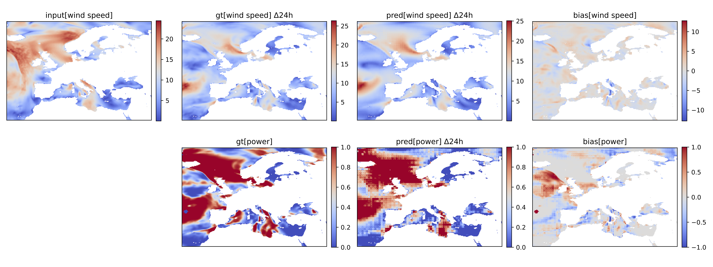
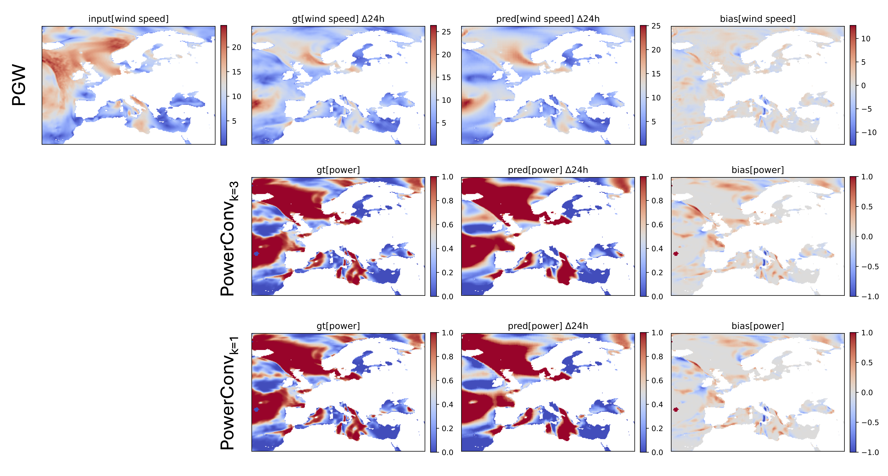
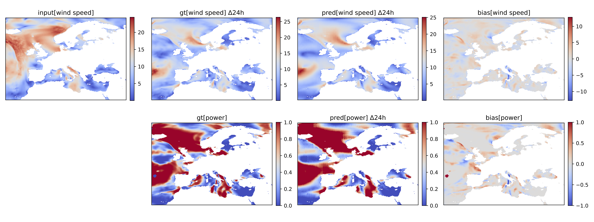

# pangu-power

This repository adapts the [Pangu-Weather](https://github.com/198808xc/Pangu-Weather) model for wind power forecasting using [Parameter-Efficient Fine-Tuning (PEFT)](https://github.com/huggingface/peft) methods. The repository is forked from Shan Zhao implementation of Pangu-Weather: [Pangu-pytorch](https://github.com/zhaoshan2/pangu-pytorch).

**Note:** the `./notebooks`-folder contains code that is not part of the package itself. The notebooks were mostly used for exploring data and creating some visualizations. This code is not required for running the pangu_power package, but included for documentation purposes.

## Wind Power Forecasting with AI Weather Models

This project explores fine-tuning a global AI weather prediction model (AIWPM), specifically Pangu-Weather, to forecast wind power capacity factors across Europe. Three PEFT strategies are investigated: PatchRecovery, PowerConv, and LoRA.

* **PatchRecovery:** Fine-tunes only the final model layer.
* **PowerConv:** Adds convolutional layers to process wind speed outputs and translate them into wind power capacity factors.
* **LoRA:** Applies low-rank adaptations to the transformer's linear layers.

The results demonstrate the feasibility and potential of adapting AIWPMs for wind power forecasting.

## Installation
**Note:** This setup is specifically for ROCm-supported GPUs. If using a different setup, a different version of PyTorch may be required.

Follow these steps to set up the environment:

1. Install **Python 3.9.16**.
2. Clone the repository:
   ```sh
   git clone https://github.com/EliasKng/pangu-pytorch
   ```
3. Create a virtual environment:
   ```sh
   python3.9 -m venv venv_amd
   ```
4. Activate the virtual environment:
   ```sh
   source venv_amd/bin/activate
   ```
5. Install the required dependencies:
   ```sh
   pip install -r requirements.txt
   ```
6. Uninstall any existing versions of PyTorch:
   ```sh
   pip uninstall torch torchvision torchaudio
   ```
7. Install PyTorch with ROCm support:
   ```sh
   pip install --force-reinstall -v "torch==2.5.0+rocm6.2" "torchaudio==2.5.0+rocm6.2" "torchvision==0.20.0+rocm6.2" --index-url https://download.pytorch.org/whl/rocm6.2
   ```
8. Run ```start_finetune_power.py```

Your environment should now be ready to run Pangu-PyTorch with ROCm support.

## Data
All required data for inference, training, and testing is stored on lsdf and correctly linked in `config.py`, therefore no further steps have to be taken here. For details on where the files are stored, see `config.py`.
The original pangu-pytorch data can be found here: https://huggingface.co/datasets/zhaoshan/pangu_pytorch.


## Examples

### PatchRecovery Forecast

### PowerConv Forecast

### LoRA Forecast
